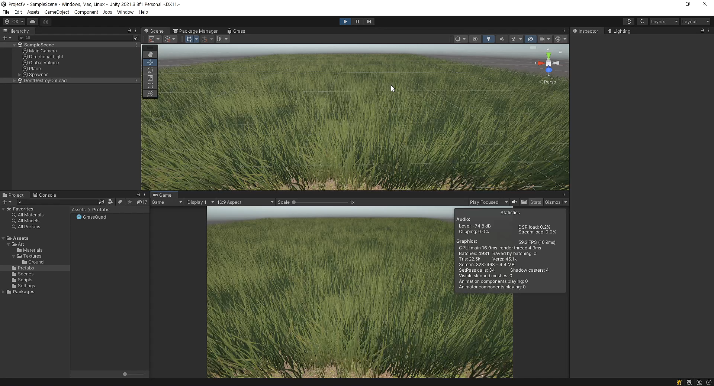
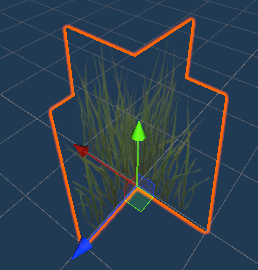
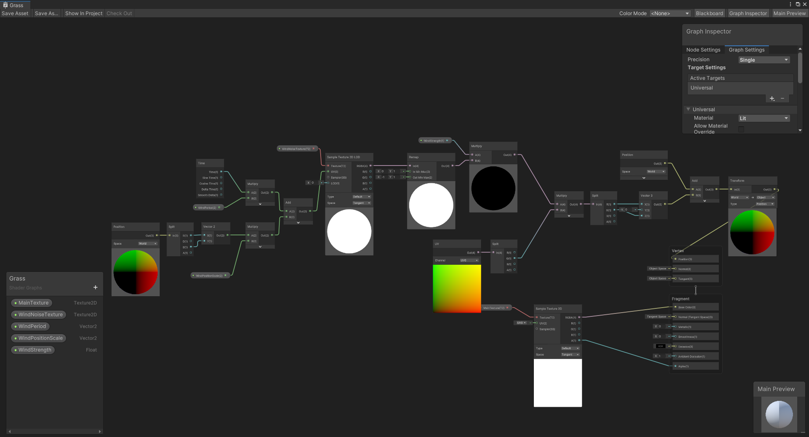
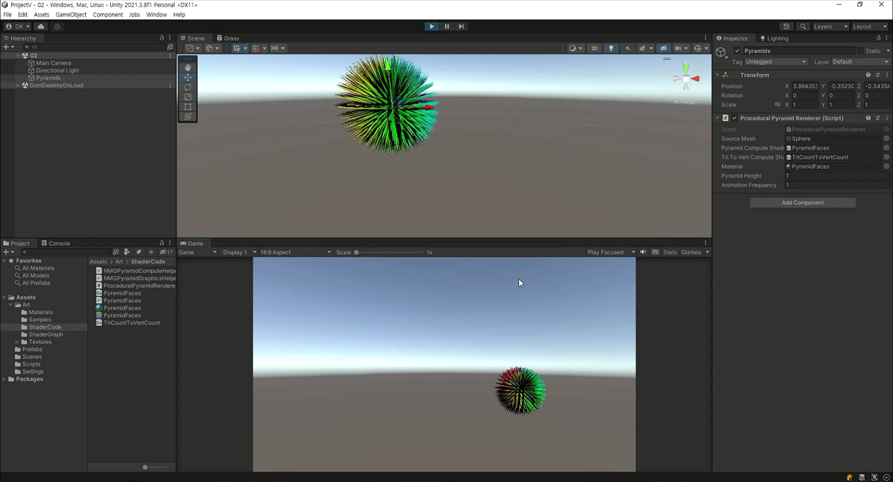
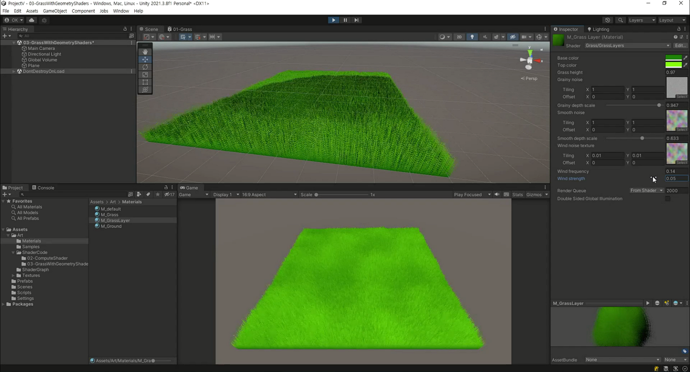
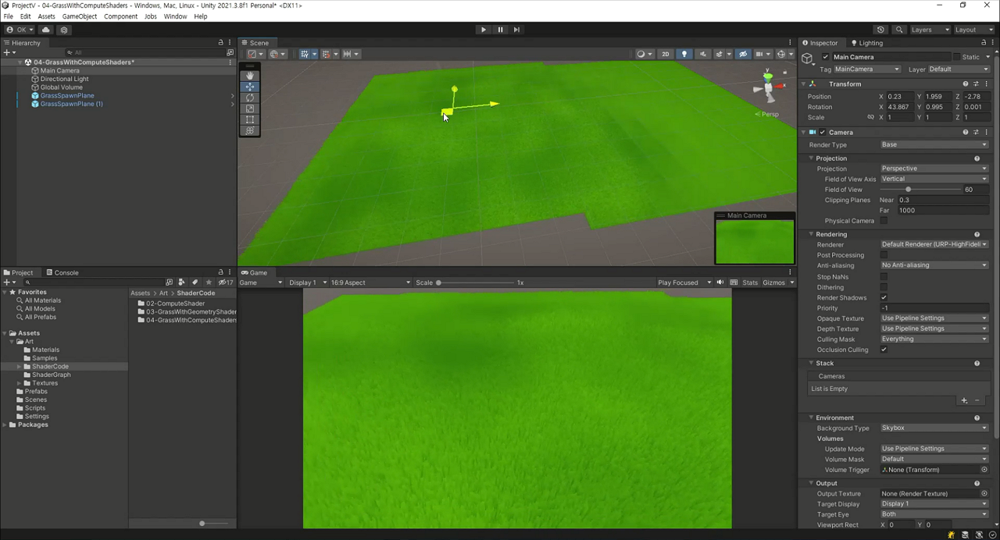

# Unity Vegetation System

## 01-Grass With Wind

### Mesh

### Shader Graph

## 02-Compute Shader

## 03-Grass With Geometry Shaders

## 04-Grass With Compute Shaders

## 05-Grass With Generating Blades

## 06-Grass With Trample Effect
[

## Reference
* Scene: 01-Grass With Wind Effect
  * [Wind Animated Grass In Unity URP Shader Graph Using Meshes](https://youtu.be/JDpt9xYaUYc)
    * [Alan Zucconi, grass techniques](https://www.alanzucconi.com/2018/07/28/shader-showcase-saturday-3/#more-9545)
    * [Casey Muratori, "The Nebraska Problem"](https://caseymuratori.com/blog_0011)
    * [Salix alba, math to find circle intersections](https://math.stackexchange.com/questions/256100/how-can-i-find-the-points-at-which-two-circles-intersect)
___
* Scene: 02-Compute Shader
  * ~~[Geometry Shaders Made Easy In Unity URP! For Those New to Shaders!](https://youtu.be/7C-mA08mp8o)~~
  * [Intro to Compute Shaders in Unity URP! Replace Geometry Shaders](https://youtu.be/EB5HiqDl7VE)
___
* Scene: 03-Grass With Geometry Shaders
  * [Rendering Grass In Unity URP Using Noise and Geometry Shaders!](https://youtu.be/YghAbgCN8XA)
    * [Shahriar Shahrabi: grass examples](https://shahriyarshahrabi.medium.com/volumetric-grass-shader-28ebb9f6860b)
    * [CJT-Jackton: geometry shader examples](https://github.com/CJT-Jackton/URP-Geometry-Shader-Example)
___
* Scene: 04-Grass With Compute Shaders
  * [Endless Fields of Grass in URP with a Compute Shader!](https://youtu.be/c1JThTu6-Ok)
    * [Keijiro Takahashi: Noise Ball](https://github.com/keijiro/NoiseBall2)
    * [Shahriar Shahrabi: grass examples](https://shahriyarshahrabi.medium.com/volumetric-grass-shader-28ebb9f6860b)
    * [DuncanF: MarchingCubesGPU](https://gist.github.com/DuncanF/353509dd397ea5f292fa52d1b9b5133d)
    * [Coding Adventure: Marching Cubes](https://youtu.be/M3iI2l0ltbE)
    * [benblo: TransformBounds](https://answers.unity.com/questions/361275/cant-convert-bounds-from-world-coordinates-to-loca.html)
___
* Scene: 05-Grass With Generating Blades
  * [Grass Fields in Unity URP! Generate Blades with Compute Shaders!](https://youtu.be/DeATXF4Szqo)
    * [Roystan: Grass Shader](https://roystan.net/articles/grass-shader/)
    * [Keijiro Takahashi: AngleAxis3x3](https://gist.github.com/keijiro/ee439d5e7388f3aafc5296005c8c3f33)
    * [Ronja Böhringer: White Noise](https://www.ronja-tutorials.com/post/024-white-noise/)
    * [Siddharth Hegde: Messing with Tangent Space](https://www.gamedeveloper.com/programming/messing-with-tangent-space)
    * [DuncanF - Lockless marching cubes with DrawProceduralIndirect](https://gist.github.com/DuncanF/353509dd397ea5f292fa52d1b9b5133d)
___    
* Scene: 06-Grass With Trample Effect
  * [Trampled Grass! Add Simple Interaction to Unity URP Shader Graph Grass](https://youtu.be/AmO7k-Lr0XM)

## Resources From ... 
  * [Lennart Demes, ground texture](https://ambientcg.com/view?id=Ground003)
  * [grass textures, Standard Assets](https://assetstore.unity.com/packages/essentials/asset-packs/standard-assets-for-unity-2018-4-32351)
  * [Grainy Noise Texture from Alan Zucconi](https://www.alanzucconi.com/2019/10/08/journey-sand-shader-3/) AI Upscaling from [Upscale.media](https://www.upscale.media/) & Filter-Noise in Photoshop
