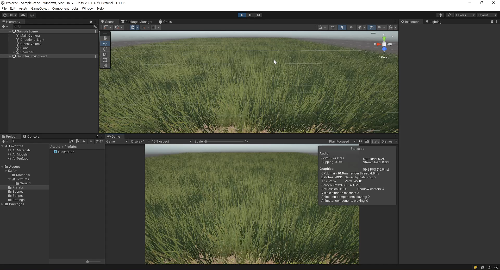

# Unity Vegetation System

## Mesh

## Shader Graph

## Reference
* Scene: 01-GrassWithWind
  * [Wind Animated Grass In Unity URP Shader Graph Using Meshes](https://youtu.be/JDpt9xYaUYc)
    * [Alan Zucconi, grass techniques](https://www.alanzucconi.com/2018/07/28/shader-showcase-saturday-3/#more-9545)
    * [Casey Muratori, "The Nebraska Problem"](https://caseymuratori.com/blog_0011)
    * [Salix alba, math to find circle intersections](https://math.stackexchange.com/questions/256100/how-can-i-find-the-points-at-which-two-circles-intersect)

* Scene: 02-
  * ~~[Geometry Shaders Made Easy In Unity URP! For Those New to Shaders!](https://youtu.be/7C-mA08mp8o)~~
  * [Intro to Compute Shaders in Unity URP! Replace Geometry Shaders](https://youtu.be/EB5HiqDl7VE)

## Resources From ... 
  * [Lennart Demes, ground texture](https://ambientcg.com/view?id=Ground003)
  * [grass textures, Standard Assets](https://assetstore.unity.com/packages/essentials/asset-packs/standard-assets-for-unity-2018-4-32351)